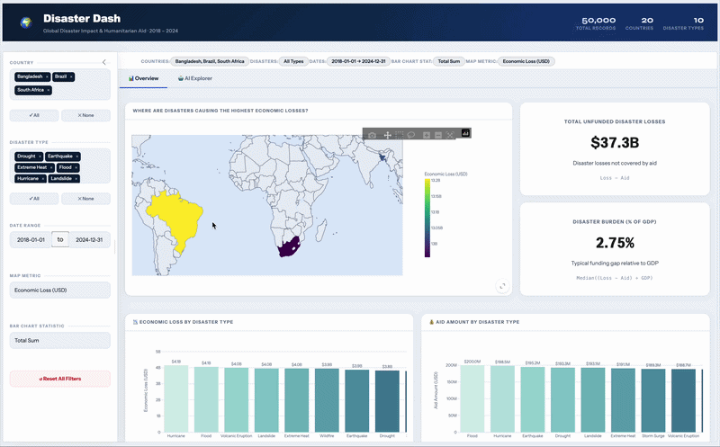

# Disaster Dash

## About

Global aid policy workers face a critical challenge: understanding where disaster aid responses are insufficient compared to actual economic losses. Without a clear understanding of the aid gaps, policymakers may struggle to develop effective responses to global disasters.

Disaster Dash is an interactive dashboard that makes these gaps visible. Users can explore global disaster frequency on a World Map, filter by disaster type, dates, and countries, and directly compare economic losses against aid responses through clear visualizations.

This dashboard is a group project for the Master of Data Science program at the University of British Columbia, DSCI 532: Data Visualization, 2025-26 Cohort.

## Deployed App

| Build | URL |
|-------|-----|
| Stable (main) | [disasterdash-stable](https://clr-saunders-dsci-532-2026-18-disasterdash-stable.share.connect.posit.cloud)|
| Preview (dev) | [disasterdash-preview](https://clr-saunders-dsci-532-2026-18-disasterdash-preview.share.connect.posit.cloud)|


## Demo



## Running the Dashboard Locally

1. Clone this repository
```bash
git clone https://github.com/UBC-MDS/DSCI-532_2026_18_disasterdash.git
cd DSCI-532_2026_18_disasterdash
```

2. Create the conda environment
```bash
conda env create -f environment.yml
```

3. Activate the environment
```bash
conda activate disaster-dash
```

4. Run the dashboard
```bash
shiny run src/app.py
```

5. Open your browser to the URL shown in the terminal.

## Contributing

See [CONTRIBUTING.md](CONTRIBUTING.md) for guidelines on how to contribute to this project.

## Contributors

| Name | GitHub |
|------|--------|
| Ojasv Issar | [@Ojasv-Issar](https://github.com/Ojasv-Issar) |
| Joel Nicholas Peterson | [@j031nich0145](https://github.com/j031nich0145) |
| Claire Saunders | [@clr-saunders](https://github.com/clr-saunders) |

## License

Software licensed under the MIT License. Content licensed under CC BY 4.0. See [LICENSE.md](LICENSE.md) for details.
