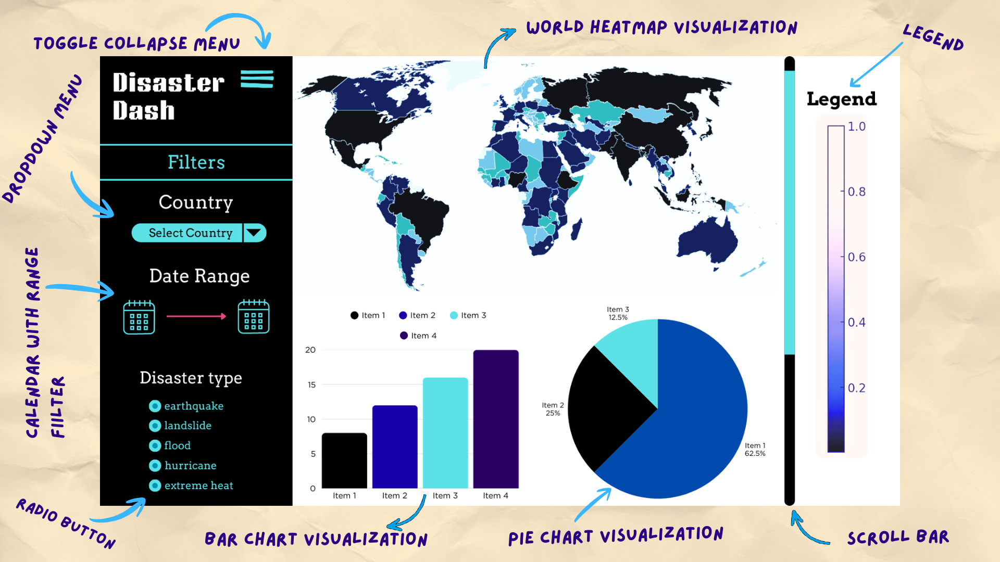

# Disaster Dash: Proposal

## Section 1: Motivation and Purpose

**Our role:** Emergency management data analysts  
**Target audience:** Global aid policy workers analyzing disaster responses worldwide

Global aid policy workers face a critical challenge: understanding where disaster aid responses are insufficient compared to actual economic losses and humanitarian needs. Without clear visibility into the gaps between disaster impacts and aid contributions, policymakers struggle to develop effective policies for improved global disaster response. The complexity of comparing economic losses, aid allocations, and disaster frequency across different regions and disaster types makes it difficult to identify systematic underfunding patterns.

We propose Disaster Dash, an interactive dashboard for exploring global disaster data (2018-2024). Our app will demonstrate global disaster frequency across time with an interactive map (togglable time ranges and disaster type selections), provide direct comparisons of economic losses versus aid responses through dual bar graphs, and display average statistics for immediate benchmarking. This empowers policy workers to identify where aid responses are insufficient, compare regional disparities, and develop evidence-based policies to support improved global disaster response.

## Section 2: Description of the Data

We will visualize the Global Disaster Response Analysis dataset (2018-2024) containing thousands of disaster events worldwide. Key variables include:

- **Geographic data** (`Country`, `Region`, `Latitude`, `Longitude`)
- **Temporal data** (`Year`, `Date`, `Start_Date`, `End_Date`)
- **Disaster characteristics** (`Disaster_Type`, `Disaster_Subtype`, `Event_Name`) - e.g., Earthquake, Flood, Hurricane, Drought
- **Impact metrics** (`Total_Deaths`, `Total_Affected`, `Injured`, `Homeless`)
- **Economic data** (`Total_Damage_USD`, `Insured_Losses`) - financial losses from disasters
- **Response information** (`Aid_Contributions`, `Response_Type`) - international and domestic aid received

We will derive key analytical variables including disaster frequency per country, **aid-to-loss ratio** (aid contributions as percentage of economic damage), **aid coverage gap** (difference between losses and aid), and average aid response metrics by disaster type and region to enable policy workers to benchmark aid adequacy.

## Section 3: Research Questions & Usage Scenarios

### Usage Scenario

Fatima is a policy analyst at a global humanitarian organization preparing recommendations for the 2026 International Disaster Response Framework. She needs to identify where disaster aid responses are systematically insufficient to [explore] the relationship between economic losses and aid contributions, [compare] disaster frequency and aid adequacy across regions, and [identify] policy interventions needed to close aid gaps.

When Fatima opens Disaster Dash, she sees a world heat map showing disaster frequency by country (2018-2024). She filters for floods and observes high frequency in South Asia. Using the economic comparison charts, she notices that while Bangladesh experienced $2.3B in flood losses, international aid contributions totaled only $450M (19.5% coverage). She compares this to the global average aid-to-loss ratio of 32% shown in the summary statistics, revealing a significant underfunding gap.

Based on these findings, Fatima recommends policy changes to increase rapid-response funding mechanisms for flood-prone South Asian regions and advocates for pre-positioned aid agreements that trigger automatically when losses exceed local response capacity.

### User Stories

**User Story 1:**  
As a **global aid policy worker**, I want to **filter disasters by type (floods, earthquakes, hurricanes, droughts)** in order to **identify which disaster types receive disproportionate or insufficient aid responses and develop type-specific funding policies**.

**User Story 2:**  
As a **global aid policy worker**, I want to **view disaster trends over time using adjustable time ranges** in order to **detect if disaster frequency is increasing in certain regions and proactively adjust long-term aid commitments before crises occur**.

**User Story 3:**  
As a **global aid policy worker**, I want to **compare disaster frequency and impacts across countries on a heat map** in order to **identify systematically underserved regions that may need dedicated aid frameworks or bilateral agreements**.

**User Story 4:**  
As a **global aid policy worker**, I want to **compare economic losses directly against aid contributions using side-by-side bar charts with average benchmarks** in order to **quantify aid gaps, identify underfunded disaster responses, and build evidence-based policy recommendations for closing those gaps**.

## Section 4: Exploratory Data Analysis

*Addressing User Story 1 (Filtering by disaster type), we analyzed disaster type distribution globally.*

**Analysis:** Visualizations in `notebooks/eda_analysis.ipynb` show: (1) Floods are the most common disaster globally (35-40% of all disasters), (2) South/Southeast Asian countries experience disproportionately high flood frequencies, and (3) Monsoon regions show clear seasonal patterns.

**Reflection:** This validates the need for disaster type filtering. By isolating floods, Fatima can identify geographic hotspots and compare against current resource deployment. The South Asian flood concentration confirms specialized teams should be stationed there. Switching between disaster types helps identify multi-hazard risk regions requiring different preparedness strategies.

*Key visualizations: (1) Bar chart of disaster type frequency, (2) Geographic heat map of floods by country, (3) Time series of disaster trends 2018-2024.*

## Section 5: App Sketch & Description

### Dashboard Layout and Components

Disaster Dash features a high-contrast purple and yellow-orange interface for visual clarity.

**Left Sidebar (Purple - Collapsible):**
- "Disaster Dash" header with hamburger menu
- **Country Filter:** Dropdown to select specific countries or "All"
- **Date Range:** Calendar-based picker (2018-2024)
- **Disaster Type:** Radio buttons (Earthquake, Landslide, Flood, Hurricane, Extreme Heat)

**Main Area (Yellow-Orange):**
- **World Heatmap:** Choropleth map with purple-to-magenta gradient showing disaster metrics by country; legend on right (0.0-1.0 scale)
- **Bar Chart:** Comparative metrics across categories
- **Pie Chart:** Proportional breakdown with percentages
- **Scrollable:** View all visualizations without resizing

**User Flow:**
1. User opens dashboard → sees global heatmap (2018-2024)
2. Selects "Flood" → all visualizations update to flood data
3. Picks date range → charts refresh to selected timeframe
4. Selects country → visualizations show country-specific statistics
5. Scrolls to examine bar/pie charts for detailed analysis

**Design Rationale:** High-contrast colors reduce eye strain; radio buttons prevent data overload; integrated multi-chart view enables simultaneous geographic, comparative, and proportional analysis; collapsible sidebar maximizes visualization space.