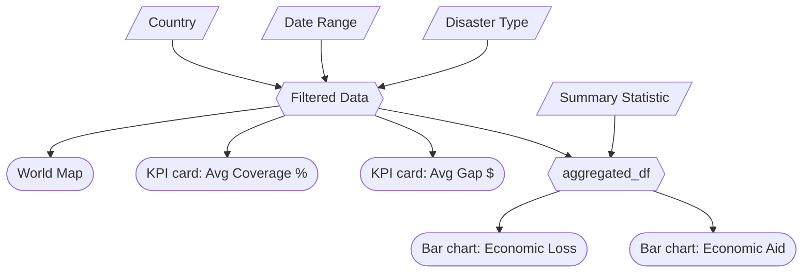

# M2 Specification — Disaster Dash

## Updated Job Stories

| # | Job Story | Status | Notes |
|---|-----------|--------|-------|
| 1 | When I am analyzing disaster aid policy, I want to filter disasters by type (floods, earthquakes, hurricanes, droughts) so I can identify which disaster types receive disproportionate or insufficient aid responses and develop type-specific funding policies. | ⏳ Pending | |
| 2 | When I am reviewing long-term disaster trends, I want to view disaster frequency over time using adjustable date ranges so I can detect if disaster frequency is increasing in certain regions and proactively adjust long-term aid commitments. | ⏳ Pending | |
| 3 | When I am comparing regional disaster impacts, I want to view disaster frequency and impacts across countries on a heat map so I can identify systematically underserved regions that may need dedicated aid frameworks or bilateral agreements. | ⏳ Pending | |
| 4 | When I am building evidence-based policy recommendations, I want to compare economic losses directly against aid contributions using side-by-side bar charts with configurable summary statistics (average, minimum, maximum, or total) and summary KPIs so I can quantify aid gaps from multiple analytical perspectives and identify underfunded disaster responses. | 🔄 Revised | Added "with summary statistics..." details to be more specific about this user's required information for understanding the gaps in aid. This reflects our addition of the additional summary stat filter input. |

## Component Inventory

| ID | Type | Shiny widget / renderer | Depends on | Job story |
|----|------|------------------------|------------|-----------|
| `countries` | Input | `ui.input_checkbox_group()` | — | #2, #3 |
| `select_all_countries` | Input | `ui.input_action_button()` | — | #1, #2, #3 |
| `date_range` | Input | `ui.input_date_range()` | — | #2 |
| `disaster_type` | Input | `ui.input_checkbox_group()` | — | #1 |
| `select_all_disasters` | Input | `ui.input_action_button()` | — | #1, #2 |
| `summary_stat` | Input | `ui.input_select()` | — | #1, #2, #3, #4 |
| `reset_button` | Input | `ui.input_action_button()` | — | #1, #2, #3, #4 |
| `filtered_df` | Reactive calc | `@reactive.calc` | `countries`, `date_range`, `disaster_type` | #1, #2, #3, #4 |
| `map_heatmap` | Output | `@render.plot` | `filtered_df` | #2, #3 |
| `plot_economic_loss` | Output | `@render.plot` | `aggregated_df` | #1, #3, #4 |
| `plot_aid_response` | Output | `@render.plot` | `aggregated_df` | #1, #3,  #4 |
| `kpi_ratio` | Output | `@render.text` | `filtered_df` | #1, #3, #4 |
| `kpi_gap` | Output | `@render.text` | `filtered_df` | #1, #3, #4 |
| `aggregated_df` | Reactive calc | `@reactive.calc` | `filtered_df`, `summary_stat` | #1, #4 |

## Reactivity Diagram

## Calculation Details

### `filtered_df`
- **Depends on:** `countries`, `date_range`, `disaster_type`
- **Transformation:** Filters the full disaster dataset to rows matching the selected disaster type(s), within the selected date range, and for the selected countries.
- **Consumed by:** `map_heatmap`, `aggregated_df`, `kpi_ratio`, `kpi_gap`

### `aggregated_df` 
- **Depends on:** `filtered_df`, `summary_stat`
- **Transformation:** Groups the filtered dataset by `disaster_type` and applies the selected summary statistic (`mean`, `sum`, `min` or `max`) to `economic_loss_usd` and `aid_amount_usd`. The default summary statistic is `sum`, emphasizing aggregate fiscal burden for policy analysis.
- **Consumed by:** `plot_economic_loss`, `plot_aid_response`

### KPI Calculations
- **`kpi_ratio`**: `sum(aid_amount_usd) / sum(economic_loss_usd) × 100` — displayed as a percentage representing how much of total economic loss is covered by aid across the filtered selection.
- **`kpi_gap`**: `sum(economic_loss_usd) - sum(aid_amount_usd)` — displayed in dollars representing the total uncovered economic loss across the filtered selection. Both KPIs always use the sum aggregation regardless of the `summary_stat` selection.