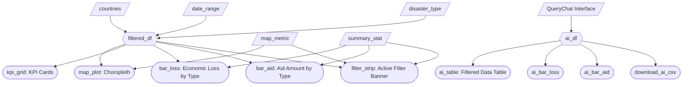

# M2 Specification — Disaster Dash

## Updated Job Stories

| # | Job Story | Status | Notes |
|---|-----------|--------|-------|
| 1 | When I am analyzing disaster aid policy, I want to filter disasters by type (floods, earthquakes, hurricanes, droughts) so I can identify which disaster types receive disproportionate or insufficient aid responses and develop type-specific funding policies. | ✅ Implemented | Multi-select disaster type filter with quick select/deselect buttons.|
| 2 | When I am reviewing long-term disaster trends, I want to view disaster frequency over time using adjustable date ranges so I can detect if disaster frequency is increasing in certain regions and proactively adjust long-term aid commitments. | ✅ Implemented | Adjustable date range filter in the sidebar. |
| 3 | When I am comparing regional disaster impacts, I want to view disaster frequency and impacts across countries on an interactive choropleth map so I can identify systematically underserved regions that may need dedicated aid frameworks or bilateral agreements. | ✅ Implemented | Map metric selector allows switching between frequency, aid coverage %, casualties, and economic loss. |
| 4 | When I am building evidence-based policy recommendations, I want to compare economic losses directly against aid contributions using side-by-side bar charts with configurable summary statistics (average, minimum, maximum, or total) and summary KPIs so I can quantify aid gaps from multiple analytical perspectives and identify underfunded disaster responses. | ✅ Implemented | Bar charts are vertical for clear comparison.  Summary statistic selector (mean, sum, min, max).  |
| 5 | When I want to explore the dataset more flexibly, I want to ask natural language questions about disasters so I can quickly generate filtered views of the data without manually adjusting multiple filters. | ✅ Implemented | Implemented via the AI Explorer tab using QueryChat. |

## Component Inventory

| ID | Type | Shiny widget / renderer | Depends on | Job story |
|----|------|------------------------|------------|-----------|
| `countries` | Input | `ui.input_selectize()` (multi-select) | — | #2, #3 |
| `sel_all_c` | Input | `ui.input_action_button()` | — | #2, #3 |
| `desel_all_c` | Input | `ui.input_action_button()` | — | #2, #3 |
| `date_range` | Input | `ui.input_date_range()` | — | #2 |
| `disaster_type` | Input | `ui.input_selectize()` (multi-select) | — | #1 |
| `sel_all_d` | Input | `ui.input_action_button()` | — | #1 |
| `desel_all_d` | Input | `ui.input_action_button()` | — | #1 |
| `summary_stat` | Input | `ui.input_select()` | — | #1, #2, #3, #4 |
| `map_metric` | Input | `ui.input_select()` | — | #3 |
| `reset_button` | Input | `ui.input_action_button()` | — | #1, #2, #3, #4 |
| `disaster_table` | Data source | ibis table backed by DuckDB | parquet dataset | #1, #2, #3, #4 |
| `filtered_df` | Reactive calc | `@reactive.calc` | `countries`, `date_range`, `disaster_type` | #1, #2, #3, #4 |
| `filter_strip` | Output | `@render.ui` | `countries`, `date_range`, `disaster_type`, `summary_stat`, `map_metric` | #1, #2, #3, #4 |
| `kpi_grid` | Output | `@render.ui` | `filtered_df` | #1, #3, #4 |
| `map_plot` | Output | `@render_widget` (Plotly choropleth) | `filtered_df`, `map_metric` | #2, #3 |
| `bar_loss` | Output | `@render_widget` (Plotly bar) | `filtered_df`, `summary_stat` | #1, #3, #4 |
| `bar_aid` | Output | `@render_widget` (Plotly bar) | `filtered_df`, `summary_stat` | #1, #3, #4 |
| `chat` | Output | `querychat` UI component | — | #5 |
| `ai_df` | Reactive calc | QueryChat filtered dataframe | `chat` | #5 |
| `ai_table` | Output | `@render.data_frame` | `ai_df` | #5 |
| `download_ai_csv` | Output | `@render.download` | `ai_df` | #5 |
| `ai_bar_loss` | Output | `@render_widget` (Plotly bar) | `ai_df` | #5 |
| `ai_bar_aid` | Output | `@render_widget` (Plotly bar) | `ai_df` | #5 |

## Reactivity Diagram

## Calculation Details

### `filtered_df`
- **Depends on:** `countries`, `date_range`, `disaster_type`
- **Transformation:** Constructs a DuckDB query using ibis that filters the Parquet dataset according to the selected countries, disaster types, and date range. These filters are applied lazily at the database level so that only matching rows are retrieved.
- **Execution:** The query is executed when the reactive value is consumed, at which point the filtered result is materialized as a pandas DataFrame (e.g., via `.to_pandas()`).
- **Consumed by:** `kpi_grid`, `map_plot`, `bar_loss`, `bar_aid`, `filter_strip`

### Bar Chart Aggregation (inline)
- **Depends on:** `filtered_df`, `summary_stat`
- **Transformation:** Groups the filtered dataset by `disaster_type` and applies the selected summary statistic (`mean`, `sum`, `min`, or `max`) to `economic_loss_usd` (for `bar_loss`) and `aid_amount_usd` (for `bar_aid`). S
- **Consumed by:** `bar_loss`, `bar_aid`

### KPI Calculations

### `kpi_grid` — Total Unfunded Disaster Losses
- **Formula:** `sum(economic_loss_usd) - sum(aid_amount_usd)`
- **Meaning:** Represents the total disaster-related economic loss not covered by humanitarian aid across the filtered selection.

### `kpi_grid` — Disaster Burden (% of GDP)
- **Formula:** `median((economic_loss_usd - aid_amount_usd) / GDP × 100)` computed at the country level.
- **Meaning:** Represents the typical disaster funding gap relative to a country's economic size, allowing comparison between large and small economies.

Both KPIs always use **sum aggregation** for loss and aid regardless of the `summary_stat` selection used in the bar charts.

### Map Aggregation (inline)
- **Depends on:** `filtered_df`, `map_metric`
- **Transformation:** Groups by `country`, computes disaster count, total casualties, total economic loss, total aid, average severity, average response time, and aid coverage %. The selected `map_metric` controls which variable drives the choropleth colour scale.

## Complexity Enhancement

### Reset All Filters Button

To improve usability and demonstrate event-driven reactivity, we implemented a **Reset All Filters** button that restores every global input to its default state.

This feature uses `@reactive.event()` in combination with `@reactive.effect()` to programmatically update all filter widgets when the reset button is clicked.

### Why This Enhances the Dashboard

* Allows users to quickly recover from overly restrictive filter combinations
* Prevents “empty state” traps during exploratory analysis
* Improves workflow efficiency when comparing multiple scenarios
* Demonstrates correct event-based reactive architecture

## Data Access Architecture

To improve performance and scalability, the dashboard reads data from a **Parquet dataset** using **DuckDB via ibis**.

Instead of loading the entire dataset into memory, user-selected filters are translated into a database query that is executed lazily. Only rows matching the selected filters are materialized into a pandas DataFrame when required by downstream reactive components.

This approach ensures that filtering occurs at the database level and allows the dashboard to scale to larger datasets while keeping memory usage low.

## AI Explorer Tab

To extend the analytical capabilities of the dashboard, Milestone 3 introduced an **AI Explorer tab** powered by QueryChat.

This feature allows users to interact with the disaster dataset using **natural language queries**. The system translates user queries into SQL filters that dynamically update the dataset used for visualization.

Example queries include:

- "Show floods in India after 2020"
- "Which country had the highest economic loss?"
- "Filter events with over 1000 casualties"

### AI Outputs

The AI Explorer tab produces:

- A **filtered data table** showing query results
- A **CSV download button** for exporting filtered results
- Two bar charts summarizing:
  - Economic loss by disaster type
  - Aid amount by disaster type

These charts are computed using **sum aggregation** and update automatically based on the AI-filtered dataset.

---

## AI Assistant Enhancements (Planned)

This section defines the next implementation changes for the AI Explorer experience. The focus is UI clarity, more reliable QueryChat behavior, stronger dataset-grounded answers, and explicit experiment-backed decision making.

### Planned User Stories

| # | Job Story | Status | Notes |
|---|-----------|--------|-------|
| 6 | When I switch to AI Explorer, I want non-AI dashboard controls hidden so I can focus on conversational analysis without irrelevant filter noise. | Planned | Hide sidebar controls and filter summary strip on AI tab only. |
| 7 | When I ask data-specific questions (counts, top-N, filters), I want the assistant to execute dataset queries before answering so I can trust numerical results. | Planned | Enforced through prompt rules and `on_tool_request` checks. |
| 8 | When I use the AI assistant, I want clearer prompts and examples so I can ask effective questions and get useful results quickly. | Planned | Improve greeting, examples, and interaction instructions. |
| 9 | When I prefer a specific answer style, I want a UI control that changes AI behavior so responses match my analysis needs. | Planned | Add one user-facing LLM behavior control (e.g., response style). |

### Requirement Traceability

| Requirement | Planned implementation | Acceptance criteria |
|-------------|------------------------|---------------------|
| Hide sidebar filters when AI tab is active | Add a tab-aware reactive condition keyed on `main_tabs` to hide sidebar sections in AI mode and show in Overview mode. | Sidebar filter controls are not visible in AI Explorer; they reappear when returning to Overview. |
| Hide filter summary strip when AI tab is active | Render `filter_strip` conditionally only for Overview tab, or hide with tab-scoped CSS class. | Active filter strip is absent in AI Explorer and present in Overview. |
| Improve system prompt context | Override QueryChat system prompt (or parts) with dataset schema, metric definitions, valid date span (2018-2024), and user goal framing (aid gap analysis). | Prompt includes explicit dataset context, user role context, and answer constraints. |
| Provide clearer example questions | Replace examples with intent-diverse, unambiguous prompts (count, filter, compare, rank, trend). | AI panel shows at least 6 examples that map to distinct analysis intents. |
| Improve instructions for interacting with AI assistant | Add concise usage instructions above chat (how to ask, what to avoid, how results propagate to table/charts). | New instruction block is visible and references the data table/charts update behavior. |
| Improve QueryChat prompt for consistent tool usage | Add explicit prompt rule: tool execution required for count/filter/rank questions; no fabricated numbers. | For numeric/filter queries, a tool call occurs before final answer in test runs. |
| Ensure dataset queries execute for counts/filtered requests | Add intent classification in prompt + `on_tool_request` validation and fallback coercion for count/filter intents. | Questions like "How many..." or "Show events where..." always trigger dataset query execution. |
| Verify tool calls update filtered dataframe for visuals | Keep `ai_df` as single source of truth from QueryChat tool outputs; add verification checks and logs for tool result -> `ai_df` -> table/charts chain. | AI table and both AI charts refresh from the same filtered frame after each successful tool call. |
| Override system prompt with meaningful context | Implement prompt-template builder that injects schema, glossary, and behavioral rules. | Prompt template is centralized and testable. |
| Use `on_tool_request` to validate/log/transform calls | Intercept tool requests to enforce read-only SQL, normalize count queries, and log requests/results metadata. | Invalid tool requests are blocked or transformed; logs capture request intent and row counts. |
| Add user-facing control affecting LLM behavior | Add `ai_response_style` input (`concise`, `policy_brief`, `step_by_step`) and pass selection into prompt context. | Changing control visibly changes response style while keeping data logic unchanged. |
| Base decisions on experimentation and document rationale | Add experiment notebook and summarize option choices + motivation in this spec. | Notebook exists in `notebooks/` and this spec contains final decision summaries after experiments. |

### Planned Component Additions

| ID | Type | Shiny widget / renderer | Depends on | Purpose |
|----|------|-------------------------|------------|---------|
| `main_tabs` | Input | `ui.navset_underline(..., id="main_tabs")` | -- | Detect active tab state for conditional UI rendering. |
| `ai_response_style` | Input | `ui.input_select()` | -- | User-facing control for LLM response behavior. |
| `ai_instructions` | Output | `@render.ui` | `ai_response_style` (optional) | Show improved interaction guidance and examples. |
| `is_ai_tab` | Reactive calc | `@reactive.calc` | `main_tabs` | Source of truth for AI-tab visibility toggles. |
| `chat_system_prompt` | Reactive calc | Prompt builder function | `ai_response_style` | Builds final QueryChat system prompt context. |
| `tool_request_audit` | Reactive value/log | `reactive.Value` or append-only list | `on_tool_request` events | Store tool request metadata for debugging and validation. |
| `ai_query_status` | Output (optional) | `@render.ui` | tool logs / `ai_df` | Expose last query execution status to user. |

### QueryChat Prompt Override Specification

The system prompt will be upgraded from a generic helper prompt to a domain-specific template with these sections:

1. Dataset context
- Table name and schema summary (country, date, disaster_type, casualties, economic_loss_usd, aid_amount_usd, etc.)
- Time coverage: 2018-01-01 to 2024-12-31
- Domain framing: global disaster aid adequacy analysis

2. User goal context
- User is a policy analyst comparing losses, aid, and funding gaps
- Prioritize transparent, reproducible, dataset-grounded responses

3. Tool-use policy
- If user asks for count, ranking, filtered records, or any numeric claim, run dataset query tools before answering
- Never fabricate counts, percentages, or top-N claims
- If query returns no rows, state that explicitly and suggest a broader filter

4. Response policy
- Respect `ai_response_style`
- Provide brief interpretation after numeric outputs
- Reference filters used in the final answer

### `on_tool_request` Interception Plan

`on_tool_request` will be used to validate, log, and (when safe) transform tool requests before execution.

Validation rules:
- Allow read-only query patterns only (no DDL/DML)
- Ensure referenced table/columns are within the known dataset schema
- Require explicit aggregation for count-style intents (`COUNT(*) AS n`)

Transformation rules:
- Normalize count prompts to explicit aggregate query shape when ambiguous
- Attach metadata tags (intent, style mode, timestamp) for audit logs

Logging rules:
- Store original request, transformed request (if any), execution success/failure, and returned row count
- Keep lightweight in-memory logs for runtime verification and optional debugging output

### AI Tab UX Behavior

When AI Explorer is active:
- Hide sidebar filters and sidebar action buttons
- Hide active filter strip
- Keep AI chat, AI data table, CSV download, and AI charts visible

When Overview is active:
- Restore existing sidebar filter controls and active filter strip

### Planned AI Example Question Bank

The AI greeting/help text will include clear, concrete examples that span the major query intents:

- "How many flood events occurred in India after 2020?"
- "Show only earthquakes in Japan between 2021 and 2023."
- "Which 5 countries had the highest total economic loss in 2024?"
- "Filter events where casualties are greater than 1000 and aid is below 10 million USD."
- "Compare total aid amount for floods vs hurricanes since 2019."
- "What is the average response time for wildfires in Australia?"
- "List countries where aid coverage is below 30 percent."
- "Show disasters in Bangladesh in 2022 and summarize total loss and aid."

### Dataset Execution and Synchronization Rules

Execution rules:
- Count/filter/top/bottom/"which country has"/"show events" questions must execute tool queries
- Conceptual questions (e.g., "what does aid coverage mean?") may answer directly without data query

Synchronization rules:
- Tool result dataframe is the only source for `ai_df`
- `ai_table`, `ai_bar_loss`, and `ai_bar_aid` must all consume `ai_df`
- Failed tool calls must not silently reuse stale data without warning

Verification checks:
- Log row counts before and after each tool-backed query
- Confirm that displayed table row count and chart aggregates correspond to the same `ai_df`

### Experimentation Notebook and Decision Rationale

To satisfy experiment-driven design requirements, the repository will include:
- `notebooks/ai_assistant_experiments.ipynb`

Planned notebook sections:
1. Prompt variants tested (baseline vs enriched context vs strict tool policy)
2. Tool interception variants (`on_tool_request`: none vs validate-only vs validate+transform)
3. User-control variants (response style options and observed output differences)
4. Evaluation metrics
  - Numeric accuracy for count/rank questions
  - Tool-use consistency for data-specific intents
  - `ai_df` synchronization reliability with charts/table
  - Response clarity from manual rubric
5. Final option selection and narrative motivation

### Decision Summary Template (To Fill After Experiments)

| Decision area | Options tested | Selected option | Motivation summary (experiment-backed) |
|---------------|----------------|-----------------|----------------------------------------|
| Prompt context strategy | Baseline / schema-only / schema+goal+tool-rules | TBD | TBD |
| Tool interception policy | None / validate / validate+transform | TBD | TBD |
| User-facing LLM control | Verbosity slider / response style dropdown / scope toggle | TBD | TBD |
| AI tab visibility behavior | CSS hide / conditional render | TBD | TBD |

After experiments are completed, this table must be updated with final selections and concise evidence-based rationale.
