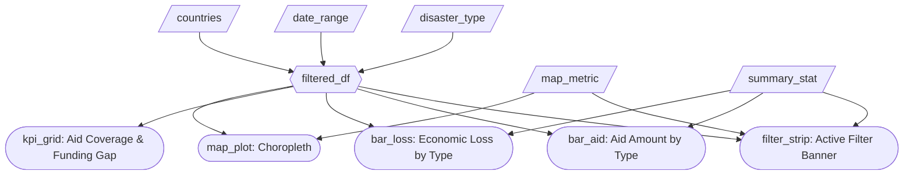

# M2 Specification — Disaster Dash

## Updated Job Stories

| # | Job Story | Status | Notes |
|---|-----------|--------|-------|
| 1 | When I am analyzing disaster aid policy, I want to filter disasters by type (floods, earthquakes, hurricanes, droughts) so I can identify which disaster types receive disproportionate or insufficient aid responses and develop type-specific funding policies. | ✅ Implemented | Multi-select disaster type filter with quick select/deselect buttons.|
| 2 | When I am reviewing long-term disaster trends, I want to view disaster frequency over time using adjustable date ranges so I can detect if disaster frequency is increasing in certain regions and proactively adjust long-term aid commitments. | ✅ Implemented | Adjustable date range filter in the sidebar. |
| 3 | When I am comparing regional disaster impacts, I want to view disaster frequency and impacts across countries on a heat map so I can identify systematically underserved regions that may need dedicated aid frameworks or bilateral agreements. | ✅ Implemented | Map metric selector allows switching between frequency, aid coverage %, casualties, and economic loss. |
| 4 | When I am building evidence-based policy recommendations, I want to compare economic losses directly against aid contributions using side-by-side bar charts with configurable summary statistics (average, minimum, maximum, or total) and summary KPIs so I can quantify aid gaps from multiple analytical perspectives and identify underfunded disaster responses. | ✅ Implemented | Bar charts are vertical for clear comparison.  Summary statistic selector (mean, sum, min, max).  |
| 5 | When I want to explore the dataset more flexibly, I want to ask natural language questions about disasters so I can quickly generate filtered views of the data without manually adjusting multiple filters. | ✅ Implemented | Implemented via the AI Explorer tab using QueryChat. |

## Component Inventory

| ID | Type | Shiny widget / renderer | Depends on | Job story |
|----|------|------------------------|------------|-----------|
| `countries` | Input | `ui.input_selectize()` (multi-select) | — | #2, #3 |
| `sel_all_c` | Input | `ui.input_action_button()` | — | #2, #3 |
| `desel_all_c` | Input | `ui.input_action_button()` | — | #2, #3 |
| `date_range` | Input | `ui.input_date_range()` | — | #2 |
| `disaster_type` | Input | `ui.input_selectize()` (multi-select) | — | #1 |
| `sel_all_d` | Input | `ui.input_action_button()` | — | #1 |
| `desel_all_d` | Input | `ui.input_action_button()` | — | #1 |
| `summary_stat` | Input | `ui.input_select()` | — | #1, #2, #3, #4 |
| `map_metric` | Input | `ui.input_select()` | — | #3 |
| `reset_button` | Input | `ui.input_action_button()` | — | #1, #2, #3, #4 |
| `filtered_df` | Reactive calc | `@reactive.calc` | `countries`, `date_range`, `disaster_type` | #1, #2, #3, #4 |
| `filter_strip` | Output | `@render.ui` | `countries`, `date_range`, `disaster_type`, `summary_stat`, `map_metric` | #1, #2, #3, #4 |
| `kpi_grid` | Output | `@render.ui` | `filtered_df` | #1, #3, #4 |
| `map_plot` | Output | `@render_widget` (Plotly choropleth) | `filtered_df`, `map_metric` | #2, #3 |
| `bar_loss` | Output | `@render_widget` (Plotly bar) | `filtered_df`, `summary_stat` | #1, #3, #4 |
| `bar_aid` | Output | `@render_widget` (Plotly bar) | `filtered_df`, `summary_stat` | #1, #3, #4 |
| `chat` | Output | `querychat` UI component | — | #5 |
| `ai_df` | Reactive calc | QueryChat filtered dataframe | `chat` | #5 |
| `ai_table` | Output | `@render.data_frame` | `ai_df` | #5 |
| `download_ai_csv` | Output | `@render.download` | `ai_df` | #5 |
| `ai_bar_loss` | Output | `@render_widget` (Plotly bar) | `ai_df` | #5 |
| `ai_bar_aid` | Output | `@render_widget` (Plotly bar) | `ai_df` | #5 |

## Reactivity Diagram

## Calculation Details

### `filtered_df`
- **Depends on:** `countries`, `date_range`, `disaster_type`
- **Transformation:** Filters the full disaster dataset to rows matching the selected disaster type(s), within the selected date range, and for the selected countries. Excludes the `"_all_"` sentinel value used by the selectize widgets.
- **Consumed by:** `kpi_grid`, `map_plot`, `bar_loss`, `bar_aid`, `filter_strip`

### Bar Chart Aggregation (inline)
- **Depends on:** `filtered_df`, `summary_stat`
- **Transformation:** Groups the filtered dataset by `disaster_type` and applies the selected summary statistic (`mean`, `sum`, `min`, or `max`) to `economic_loss_usd` (for `bar_loss`) and `aid_amount_usd` (for `bar_aid`). Sorted ascending for horizontal bar layout.
- **Consumed by:** `bar_loss`, `bar_aid`

### KPI Calculations

### `kpi_grid` — Total Unfunded Disaster Losses
- **Formula:** `sum(economic_loss_usd) - sum(aid_amount_usd)`
- **Meaning:** Represents the total disaster-related economic loss not covered by humanitarian aid across the filtered selection.

### `kpi_grid` — Disaster Burden (% of GDP)
- **Formula:** `median((economic_loss_usd - aid_amount_usd) / GDP × 100)` computed at the country level.
- **Meaning:** Represents the typical disaster funding gap relative to a country's economic size, allowing comparison between large and small economies.

Both KPIs always use **sum aggregation** for loss and aid regardless of the `summary_stat` selection used in the bar charts.

### Map Aggregation (inline)
- **Depends on:** `filtered_df`, `map_metric`
- **Transformation:** Groups by `country`, computes disaster count, total casualties, total economic loss, total aid, average severity, average response time, and aid coverage %. The selected `map_metric` controls which variable drives the choropleth colour scale.

## Complexity Enhancement

### Reset All Filters Button

To improve usability and demonstrate event-driven reactivity, we implemented a **Reset All Filters** button that restores every global input to its default state.

This feature uses `@reactive.event()` in combination with `@reactive.effect()` to programmatically update all filter widgets when the reset button is clicked.

### Why This Enhances the Dashboard

* Allows users to quickly recover from overly restrictive filter combinations
* Prevents “empty state” traps during exploratory analysis
* Improves workflow efficiency when comparing multiple scenarios
* Demonstrates correct event-based reactive architecture
